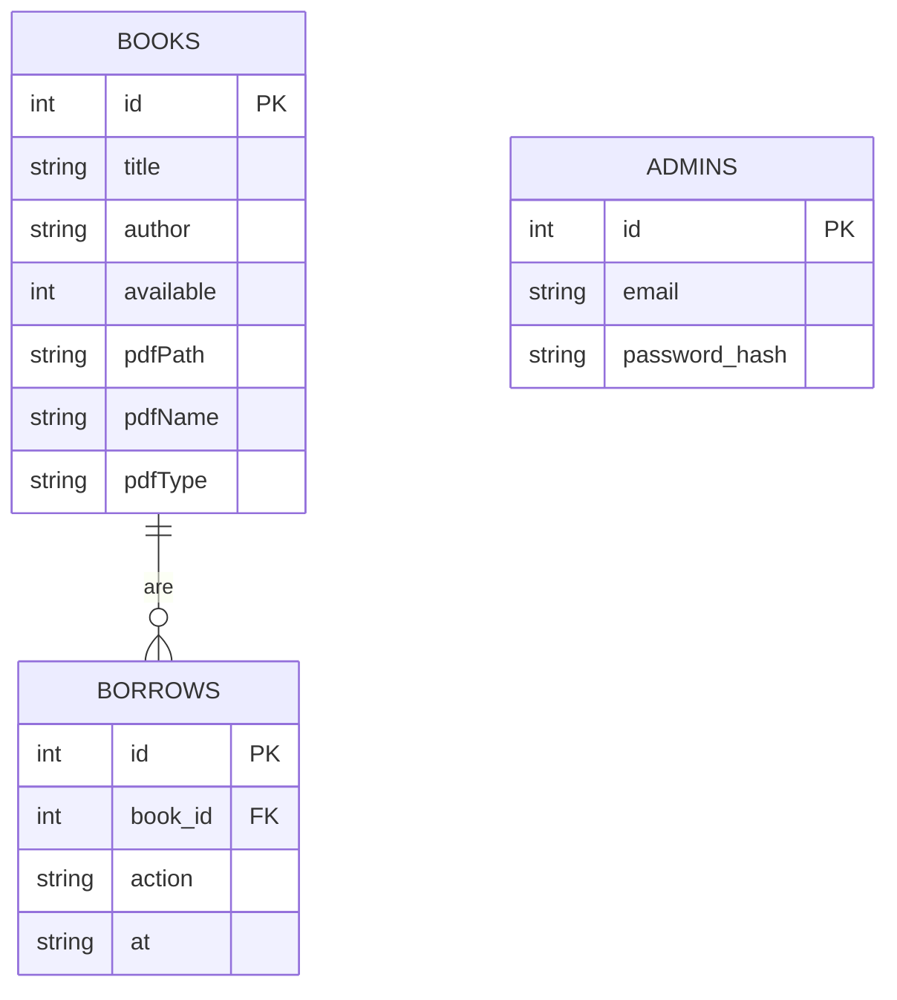

# Biblioteca virtuală

Aplicația **Virtual Library** este un site web pentru evidența și citirea cărților în format PDF. Proiectul oferă o interfață publică pentru căutarea titlurilor și un panou de administrare pentru adăugarea cărților, încărcarea fișierelor PDF și modificarea stării de disponibilitate.

## 1. Utilitatea site-ului realizat

Site-ul are rolul de a simula o bibliotecă digitală modernă:

- permite consultarea rapidă a catalogului;
- afișează dacă o carte este disponibilă sau împrumutată;
- oferă citirea PDF-urilor direct în browser;
- pune la dispoziție un modul de administrare pentru actualizarea colecției;
- păstrează datele local, fără a necesita un server de baze de date dedicat.

## 2. Tehnologii utilizate

| Tehnologie | Rol |
| --- | --- |
| Next.js 13 | Structura aplicației, pagini și API-uri |
| React 18 | Construirea interfeței cu componente funcționale |
| JavaScript / Node.js | Logica server-side și manipularea fișierelor |
| CSS global (`styles.css`) | Stilizarea interfeței publice și de administrare |
| `bcryptjs` | Hash-uirea parolelor administratorului |
| `jsonwebtoken` | Generarea și verificarea cookie-ului JWT |
| `fs` și `path` | Persistența fișierelor în `data/state.json` și salvarea PDF-urilor |

## 3. Schema funcțională a aplicației

```mermaid
flowchart TD
    U[Utilizator public] --> P1[/Pagina publică /]
    P1 --> A1[GET /api/books]
    A1 --> D1[(data/state.json)]
    D1 --> P1
    P1 --> R1[/books/[id] cititor PDF/]

    AD[Administrator] --> L1[/admin/login/]
    L1 --> A2[POST /api/admin/login]
    A2 --> C1[Cookie JWT HttpOnly]
    C1 --> D1

    C1 --> ADM[/admin/dashboard/]
    ADM --> A3[POST /api/admin/books]
    ADM --> A4[POST /api/admin/borrow]
    A3 --> D1
    A3 --> UP[(public/uploads/books)]
    A4 --> D1

    S[scripts/setup-admin.js] --> D1
```

### Fluxul principal

1. Utilizatorul accesează pagina publică și descarcă lista cărților prin `/api/books`.
2. Căutarea și filtrarea se fac în browser.
3. Administratorul se autentifică în `/admin/login`.
4. După autentificare, panoul `/admin/dashboard` permite adăugarea unei cărți sau schimbarea stării acesteia.
5. PDF-ul încărcat este salvat în `public/uploads/books` și afișat în pagina `/books/[id]`.

## 4. Prezentarea modulelor publice și de administrare

| Modul | Scop | Legătura cu datele | Module subordonate |
| --- | --- | --- | --- |
| `/` | Afișează catalogul public | citește colecția `books` prin `/api/books` | căutare, filtrare, carduri de carte, indicatori de stare |
| `/books/[id]` | Deschide cititorul PDF | caută o carte după `id` în `data/state.json` | verificare existență PDF, iframe pentru citire |
| `/admin` | Poartă de acces către administrare | nu modifică direct datele; trimite spre autentificare | linkuri către login și dashboard |
| `/admin/login` | Autentifică administratorul | apelează `/api/admin/login`, care verifică tabela logică `admins` | formular email/parolă, mesaj de eroare |
| `/admin/dashboard` | Administrarea catalogului | citește `books` și actualizează `books` / `borrows` | formular de adăugare, încărcare PDF, filtrare, comutare împrumut/returnare |
| `/api/books` | Endpoint public | returnează `books` | sortare, serializare JSON |
| `/api/admin/login` | Endpoint de autentificare | citește `admins` | bcrypt, JWT, cookie |
| `/api/admin/books` | Adăugare carte și PDF | scrie în `books` și în `public/uploads/books` | validare PDF, rollback la eroare |
| `/api/admin/borrow` | Schimbă starea cărții | actualizează `books.available` și adaugă în `borrows` | verificare stare, jurnalizare operații |

## 5. Diagrama entitate-relație

> Aplicația folosește persistență JSON, dar pentru raport modelul este echivalent cu o bază de date relațională formată din trei entități.



## 6. Structura fiecărui modul (tabelă)

### 6.1. Tabela logică `books`

| Câmp | Tip | Caracteristici |
| --- | --- | --- |
| `id` | integer | cheie primară, identificator unic |
| `title` | text | obligatoriu, titlul cărții |
| `author` | text / null | opțional, numele autorului |
| `available` | integer | `1` = disponibil, `0` = împrumutat |
| `pdfPath` | text / null | calea publică spre PDF |
| `pdfName` | text / null | numele original al fișierului |
| `pdfType` | text / null | tip MIME, de regulă `application/pdf` |

### 6.2. Tabela logică `borrows`

| Câmp | Tip | Caracteristici |
| --- | --- | --- |
| `id` | integer | cheie primară, identificator unic al operației |
| `book_id` | integer | cheie străină către `books.id` |
| `action` | text | valoare posibilă: `borrow` sau `return` |
| `at` | text | data și ora în format ISO |

### 6.3. Tabela logică `admins`

| Câmp | Tip | Caracteristici |
| --- | --- | --- |
| `id` | integer | cheie primară |
| `email` | text | identificator de autentificare; logic unic |
| `password_hash` | text | hash bcrypt al parolei |

### 6.4. Relații

- `books` 1:N `borrows`
- `admins` nu are relații directe cu celelalte tabele, fiind folosită doar pentru autentificare
- starea de disponibilitate este păstrată direct în `books.available`

## 7. Popularea cu date și exemple de interogări `SELECT`

### 7.1. Date de exemplu

| books.id | title | author | available |
| --- | --- | --- | --- |
| 1 | Micul Prinț | Antoine de Saint-Exupéry | 1 |
| 2 | Alice în Țara Minunilor | Lewis Carroll | 1 |
| 3 | Enigma Otiliei | George Călinescu | 0 |

| borrows.id | book_id | action | at |
| --- | --- | --- | --- |
| 1 | 3 | borrow | 2026-05-16T14:33:12.685Z |
| 2 | 3 | return | 2026-05-16T14:33:13.545Z |

| admins.id | email | password_hash |
| --- | --- | --- |
| 1 | admin@example.com | `bcrypt-hash` |

### 7.2. Exemple de interogări `SELECT`

```sql
SELECT * FROM books ORDER BY id DESC;
SELECT * FROM borrows ORDER BY at DESC;
SELECT * FROM admins;
```

### 7.3. Exemple de rezultat

```text
books
id | title                     | author                    | available
1  | Micul Prinț               | Antoine de Saint-Exupéry  | 1
2  | Alice în Țara Minunilor   | Lewis Carroll             | 1
3  | Enigma Otiliei            | George Călinescu          | 0
```

## 8. Textul sursă pentru cele mai importante module

### 8.1. Modulul de persistență (`lib/db.js`)

```javascript
function getBooks(){
  const s = readState();
  return (s.books || []).slice().sort((a,b)=>b.id - a.id);
}

function addBook(title, author, extras){
  const meta = extras || {};
  const s = readState();
  s.books = s.books || [];
  const id = (s.books.reduce((m,b)=>Math.max(m,b.id||0), 0) || 0) + 1;
  const book = {
    id,
    title,
    author: author || null,
    available: 1,
    pdfPath: meta.pdfPath || null,
    pdfName: meta.pdfName || null,
    pdfType: meta.pdfType || null
  };
  s.books.push(book);
  writeState(s);
  return id;
}
```

### 8.2. Autentificarea administratorului (`pages/api/admin/login.js`)

```javascript
export default function handler(req,res){
  if(req.method !== 'POST') return res.status(405).end();
  const { email, password } = req.body;
  const row = db.findAdminByEmail(email);
  if(!row) return res.status(401).json({error:'Invalid'});
  if(!bcrypt.compareSync(password, row.password_hash)) return res.status(401).json({error:'Invalid'});
  const token = jwt.sign({adminId: row.id}, process.env.ADMIN_SECRET || 'dev_secret', {expiresIn:'8h'});
  res.setHeader('Set-Cookie', `token=${token}; HttpOnly; Path=/; Max-Age=${8*3600}`);
  res.status(200).json({ok:true});
}
```

### 8.3. Adăugarea cărților și încărcarea PDF-ului (`pages/api/admin/books.js`)

```javascript
function savePdfFile(bookId, pdfData, pdfName){
  if (typeof pdfData !== 'string' || !pdfData) {
    throw new Error('PDF data is required.');
  }

  const buffer = Buffer.from(pdfData, 'base64');
  if (!buffer.length || buffer.toString('utf8', 0, 4) !== '%PDF') {
    throw new Error('Uploaded file must be a valid PDF.');
  }

  const uploadDir = path.join(process.cwd(), 'public', 'uploads', 'books');
  fs.mkdirSync(uploadDir, { recursive: true });

  const fileName = `${bookId}-${safeFileName(pdfName || 'book.pdf')}`;
  const filePath = path.join(uploadDir, fileName);
  fs.writeFileSync(filePath, buffer);

  return `/uploads/books/${fileName}`;
}
```

### 8.4. Schimbarea stării unei cărți (`pages/api/admin/borrow.js`)

```javascript
if(action === 'borrow' && book.available){
  db.updateBookAvailability(bookId, false);
  db.addBorrow(bookId, 'borrow');
  return res.status(200).json({ok:true});
}
if(action === 'return' && !book.available){
  db.updateBookAvailability(bookId, true);
  db.addBorrow(bookId, 'return');
  return res.status(200).json({ok:true});
}
return res.status(400).json({error:'invalid action/state'});
```

## 9. Configurare și rulare

1. Setează variabilele `ADMIN_EMAIL`, `ADMIN_PASSWORD` și `ADMIN_SECRET` în `.env`.
2. Rulează `npm install`.
3. Rulează `npm run setup-admin`.
4. Pornește aplicația cu `npm run dev`.

## 10. Observații finale

- Proiectul este construit ca o aplicație Next.js cu persistență locală.
- Modelul de date este simplu și ușor de extins dacă se trece ulterior la o bază de date SQL reală.
- Modulul de administrare este separat de zona publică și este protejat prin autentificare JWT.